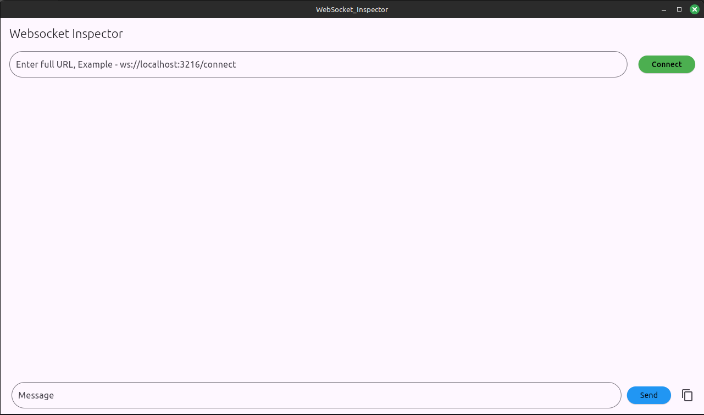

# WebSocket_Inspector

### Getting Started

## A simple websocket testing tool for Linux/windows/Android/IOS.
#### It's a lighweight GUI tool as hercules is not available for Linux

### Step to Run on Linux 
#### Download the Repo and navigate to Dist Foler 
#### Extract the Linux Zip and start using the app by double clicking it.

### Setps for other Platform
#### Download the Repo and build for your platfrom, Please refer the Flutter Docs to run/build for your platform

### How to Use the Tool 

#### After launching the put the ws URL and click connect, This will stablish the connection.
#### You will start receiving the message from socket if server is sending.
#### In the bottom field add the message and click send to send the message to server.

* Any feature request is always welcome.
* Will Keep adding features